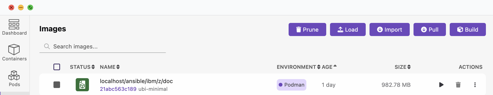
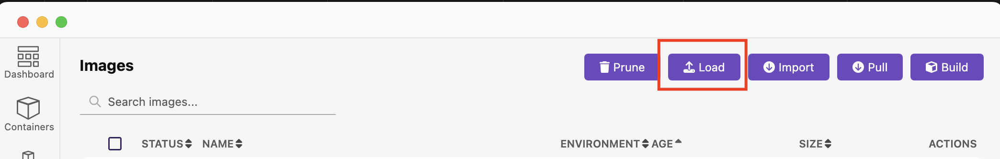
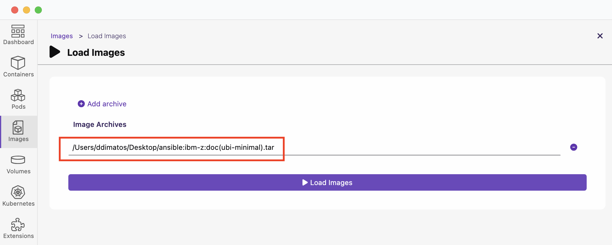

<!-- META -->
<a id="readme-top"></a>

<!-- Breadcrumbs -->
[Home](../README.md) ▸ [Podman Image](README.md)

### Podman Image
To use this container there are two options.
1. You can build it from the [Containerfile](../../container/Containerfile).
2. You can load the pre-built image archive.

### 2.1 - Build the image using the Containerfile
A podman container file is a text file that contains instructions for creating a container image. This file, which must be named `Containerfile` defines the base image, software packages to install, environment variables to set, and commands to run when the container is initialized. Podman uses these instructions to build and manage the container.

1. Begin by copying the `Containerfile` to a location on your computer or you can clone this repository and access the `Containerfile`.
   1. To download the [Containerfile](../../container/Containerfile), navigate to the file and click on the `Raw` option in GitHub and select all the text and save it to a file named `Containerfile`, it must be named with this convention.

   2. To clone the [repository](https://github.com/IBM/z_ansible_collections_doc.git), use command:

        ```
        git clone https://github.com/IBM/z_ansible_collections_doc.git
        ```
2. Build the podman image either using Podman Desktop or Podman Command Line Interface (CLI).
   1. To build the image using Podman Desktop, follow the instructions outlined in the guide under [Building an image on your container image](https://podman-desktop.io/docs/containers/images/building-an-image).
   2. To build the image using the CLI [podman build command](https://docs.podman.io/en/latest/markdown/podman-build.1.html), open a terminal and navigate (`cd`) to where the `Containerfile` is located, optionally you can use the Containerfile absolute path if that is easier, for that use the [-f](https://docs.podman.io/en/latest/markdown/podman-build.1.html#file-f-containerfile) option, see examples below.
      1. In this example, we will build the image with the [name](https://docs.podman.io/en/latest/markdown/podman-build.1.html#tag-t-imagename) `ansible/ibm-z/doc:ubi-minimal`  using the Contentfile local the to working directory without a registry name. With no registry name, `localhost` is prepended to the image name, thus the image name will be `localhost/ansible/ibm-z/doc:ubi-minimal`:
            ```
            podman build . --tag ansible/ibm-z/doc:ubi-minimal
            ```

            <br>

      2. In this example, we will use the Containerfile absolute path with the with the [-f](https://docs.podman.io/en/latest/markdown/podman-build.1.html#file-f-containerfile) option
            ```
            podman build -f /absolute/path/to/Containerfile --tag ansible/ibm-z/doc:ubi-minimal
            ```

### 2.2 - Obtain the prebuilt image
If you would rather use the prebuilt image, you must be an IBM employee and have access to the correct repository, note that the size of the image is approximately 1 GB, if your download speed is unable to accommodate the size, consider using the `Containerfile` and built the image yourself.

1. Begin by requesting access to the prebuilt image, send an email to `hcfres@us.ibm.com` and request access to the Podman image used to build Red Hat Ansible Certified Content for IBM Z.

### 2.3 - Load the prebuilt image
1. After the download is complete, follow the instructions on how to [load images from a tar archive on your local machine](https://podman-desktop.io/tutorial/managing-your-application-resources#managing-images).Provide a reason as to why you need access.

      <br>

      <br>

