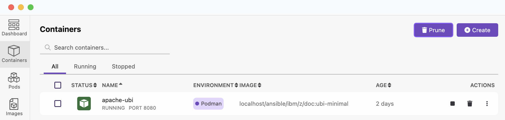
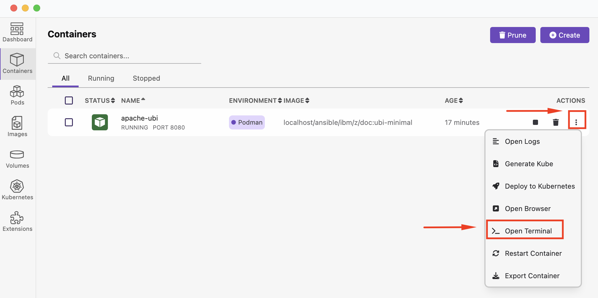
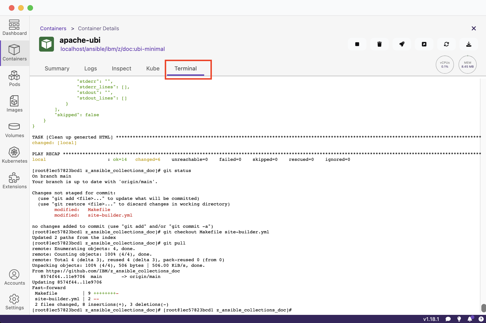

<!-- META -->
<a id="readme-top"></a>

<!-- Breadcrumbs -->
[Home](../README.md) ▸ [Podman Container](README.md)

### Podman Container
In this section, we will discuss starting, stoping and attaching the container.

### 3.1 - Start the container in detached mode
Because the container includes an Apache HTTP server used to render the generated documentation before publishing, the container must be started in detached mode. The easiest way to start a container in detached mode is to use the Podman [run](https://docs.podman.io/en/latest/markdown/podman-run.1.html) command that and follows this syntax:

```
podman run [options] image [command [arg ...]]
```

The basic options for the `run` command are:
```
--detach (-d): Runs the container in the background and prints the new container ID.
--attach (-a): Runs the container in the foreground mode.
--name (-n): Assigns a name to the container. If a name is not assigned to the container then it generates a random string name.
--rm: Automatically remove the container when it exits. Note that the container will not be removed when it could not be created or started successfully.
--tty (-t): Allocates and attaches the pseudo-terminal to the standard input of the container.
--interactive (-i): For interactive processes, use -i and -t together to allocate a terminal for the container process. The -i -t is often written as -it.
--publish (-p): Publish a container’s port, or range of ports, to the host.
```

1. Start the container with the `run` command with the `--detach (-d)`, `--tty (-t)`, `--publish (-p)` and `--name (-n)` options.

    ```
    podman run -dt -p 8080:80 --name apache localhost/ansible/ibm/z/doc
    ```

    Yields the container id, note it is worth noting the container ID for use with other commands.
    ```
    ea4cf2161459c25ef9d7a76bdde1e42b8bdf06e2d92054b9c0012a4c8f0b2c56
    ```

    You can also view the container running from Podman Desktop.
    <br>


    > **_NOTE:_**
    > If you start the container in Podman Desktop, by default it does not start in detached mode and therefore will not be able to view any of the generated documentation in a browser.

### 3.2 - Connect interactively to a container
There are 2 ways to connect to the container so that you can interactively run commands the containers shell much like you would on your local compute. By connecting interactively, you will be able to run any of the common commands used to generate documentation, including `git` and `ansible-playbook`.

1. From the command line you can use the Podman [exec](https://docs.podman.io/en/latest/markdown/podman-exec.1.html#name) command execute a shell process that you will be able to interact with.
   1. In order to run the `exec` command you will need to know either the containers name or Container ID, the easiest way to access this information is to use the Podman [ps command](https://docs.podman.io/en/latest/markdown/podman-ps.1.html):
        ```
        podman ps
        ```

        Yields:
        ```
        CONTAINER ID  IMAGE                                    COMMAND               CREATED       STATUS        PORTS                 NAMES
        1ec57823bcd1  localhost/ansible/ibm/z/doc:ubi-minimal  /usr/sbin/httpd -...  37 hours ago  Up 8 seconds  0.0.0.0:8080->80/tcp  apache-ubi
        ```
      2. Now that you have the container ID `1ec57823bcd1` you can run the `exec` command:
           ```
           podman exec -it 1ec57823bcd1 /bin/bash
           ```

           Yields the below, but also includes a `pwd` and `ls` just to be sure we are looking at the containers files.
           ```
           [root@1ec57823bcd1 z_ansible_collections_doc]# pwd
           /home/rhacc/z_ansible_collections_doc

           [root@1ec57823bcd1 z_ansible_collections_doc]# ls
           LICENSE    deprecated-2-site-builder.yml  group_vars  registry.yml	    setup.sh	      site-deploy.yml		  site-uploader.yml
           Makefile   deprecated-site-builder.yml	  inventory   requirements.txt	    site	      site-remove-submodules.yml  source
           README.md  env.cfg			  py-venv.sh  requirements.txt.org  site-builder.yml  site-teardown.yml
           ```

           If you want to use the container name instead of the container ID, you can find the name under the NAMES column from `ps`, that command and yield is below:
           ```
           podman exec -it apache-ubi /bin/bash
           [root@1ec57823bcd1 z_ansible_collections_doc]#
           ```

           Now you can begin running commands to generate documentation which will be covered elsewhere.

   3. Optionally, you can run the shell interactively in the container right from Podman Desktop as well.

      For that, in Podman Desktop navigate to the Containers view, find your container and select "Open Terminal" from the dot selection menu.
      <br>

      Once the terminal has been opened, you can can interact with the container under the terminal tab.
      <br>

### 3.3 - Other commands to aid in managing the container
There are many [more commands](https://docs.podman.io/en/latest/Commands.html) you can use to mange containers, in this section a few more will be included.

1. List the images in local storage
   ```
   $ podman images
   ```

   Yields:
   ```
   REPOSITORY                         TAG         IMAGE ID      CREATED         SIZE
   localhost/ansible/ibm/z/doc        latest      3187123ebece  56 minutes ago  585 MB
   registry.fedoraproject.org/fedora  latest      2312c2296ef8  14 hours ago    176 MB
   ```

2. Display the running processes of a container, this will show the Apache process running in this container.

   ```
   $ podman top 1ec57823bcd1
   ```

   Yields:
   ```
   USER        PID         PPID        %CPU        ELAPSED          TTY         TIME        COMMAND
   root        1           0           0.090       37m5.84660832s   pts/0       2s          /usr/sbin/httpd -DFOREGROUND
   apache      2           1           0.000       37m5.848684612s  pts/0       0s          /usr/sbin/httpd -DFOREGROUND
   apache      3           1           0.045       37m5.848731737s  pts/0       1s          /usr/sbin/httpd -DFOREGROUND
   apache      41          1           0.045       37m5.848772487s  pts/0       1s          /usr/sbin/httpd -DFOREGROUND
   apache      57          1           0.045       37m5.848818445s  pts/0       1s          /usr/sbin/httpd -DFOREGROUND
   ```
3. To stop the container

   ```
   $ podman stop 1ec57823bcd1
   ```

   Yielding below with the added `ps` check.
   ```
    $: podman stop 1ec57823bcd1
    1ec57823bcd1

    $: podman ps
    CONTAINER ID  IMAGE       COMMAND     CREATED     STATUS      PORTS       NAMES
   ```