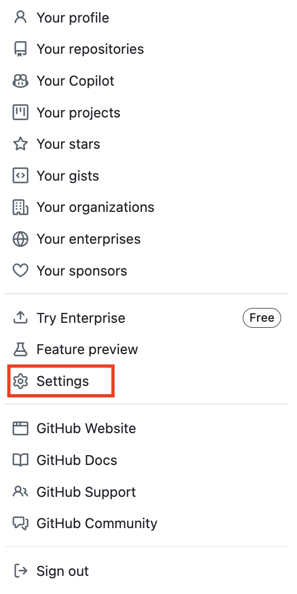
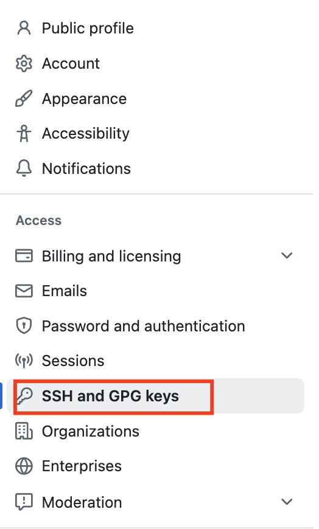
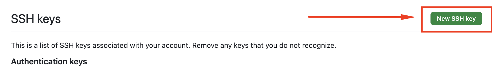
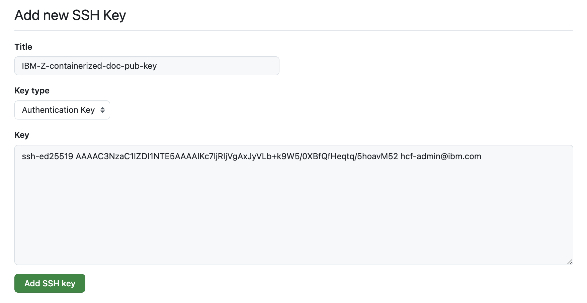
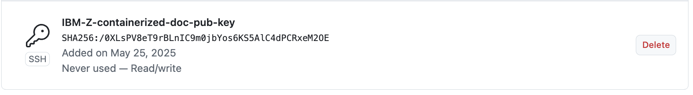

<!-- META -->
<a id="readme-top"></a>

<!-- Breadcrumbs -->
[Home](../README.md) ▸ [Add the containers SSH key to your GitHub account](README.md)

### Add the SSH key to your GitHub account
The container contains a SSH key, it is created as part of the image container file. You can access and write data in repositories on GitHub using SSH (Secure Shell Protocol). When you connect via SSH, you authenticate using a private key file on your local machine. This is required when you are going to be publishing the generated documentation to GitHub. This step is not required if you will only generate documentation for local viewing. 

### 4.1 - Copy the SSH public key
To copy the SSH public key, you must have an interactive session active with the container, this was covered in [section 3.2](../03/README.md#32---connect-interactively-to-a-container).

1. Dump the public SSH Public Key contents to the terminal and copy them with command:
   ```
   cat ~/.ssh/id_ed25519.pub
   ```

   Yields:
   ```
   ssh-ed25519 AAAAC3NzaC1lZDI1NTE5AAAAIKc7ljRIjVgAxJyVLb+k9W5/0XBfQfHeqtq/5hoavM52 hcf-admin@ibm.com
   ```

   > **_NOTE:_**
   > The key that will display for your container instance will not be the same as the example above, be sure to extract the SSH public key retained in your container.


### 4.2 - Add the SSH public key to GitHub
To add the SSH public key, follow the [instructions provided by GitHub](https://docs.github.com/en/authentication/connecting-to-github-with-ssh/adding-a-new-ssh-key-to-your-github-account#adding-a-new-ssh-key-to-your-account).

Below are a series of screen captures that align to the link provided by Git Hub on how to add the SSH public key.

1. In the upper-right corner of any page on GitHub, click your profile photo, then click  Settings.
<br>

2. In the "Access" section of the sidebar, click  SSH and GPG keys.
<br>

3. Click New SSH key or Add SSH key.
<br>

4. In the "Title" field, add a descriptive label for the new key. For example, "IBM-Z-containerized-doc-pub-key".
   1. Select the "Authentication Key" as the type of key.
   2. Click Add SSH key.
<br>
<br>

