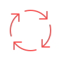

.. ...........................................................................
.. © Copyright IBM Corporation 2020, 2025                                   .
.. ...........................................................................

===========================================
Red Hat Ansible Certified Content for IBM Z
===========================================

Welcome to the Red Hat® Ansible Certified Content for IBM Z documentation. |br|

Here you will find step-by-step user walkthroughs, best practices and resources
to aid in your Ansible for IBM Z journey. **Ansible for IBM Z** provides the ability
to connect IBM Z to your wider enterprise automation strategy through the Ansible
Automation Platform ecosystem. This enables development and operations automation
on IBM Z through a seamless, unified workflow orchestration with configuration
management, provisioning, and application deployment in one easy-to-use platform.

.. |cicd| image:: shared_images/cicd.svg
   :scale: 50%
   :align: middle
   :class: no-scaled-link

.. |collection| image:: shared_images/collection.png
   :scale: 30%
   :align: middle
   :class: no-scaled-link

.. |mainframe| image:: shared_images/mainframe.png
   :scale: 30%
   :align: middle
   :class: no-scaled-link

.. |provision| image:: shared_images/provision.svg
   :scale: 50%
   :align: middle
   :class: no-scaled-link

.. ..........................................................................
.. Overview
.. ..........................................................................

.. _Ansible for IBM Z:
   overview/ansible-for-ibm-z.html
.. _Ansible for IBM Z Glossary:
   overview/ansible-glossary.html
.. _Ansible for IBM Z Playbooks:
   overview/ansible-playbooks.html
.. _Ansible for IBM Z Trial:
   overview/ansible-for-ztrial.html

.. ..........................................................................
.. Installation & Execution
.. ..........................................................................

.. _Software Requirements:
   requirements/software-requirements.html
.. _Software Installation:
   installation/software-installation.html
.. _Software Configuration:
   configuration/software-configuration.html

.. ..........................................................................
.. Collections & Content
.. ..........................................................................

.. _Collections:
   collections_content/collections.html
.. _Collection Releases:
   collections_content/collection-releases.html
.. _Collection Life Cycles:
   collections_content/collection-life-cycles.html

.. ..........................................................................
.. Help & Troubleshooting
.. ..........................................................................

.. _Getting Support:
   help/getting-support.html
.. _Frequently Asked Questions:
   help/faqs.html
.. _Supplementary Documentation:
   help/supplementary-doc.html
.. _Helpful Links:
   help/helpful-links.html
.. _Contributing:
   contribution/contributing.html

.. grid:: 3

   .. grid-item:: |topology| Overview

      * `Ansible for IBM Z`_
      * `Ansible for IBM Z Glossary`_
      * `Ansible for IBM Z Playbooks`_
      * `Ansible for IBM Z Trial`_

   .. grid-item:: |mainframe| Installation & Execution

      * `Software Requirements`_
      * `Software Installation`_
      * `Collection Life Cycles`_

.. grid:: 3

   .. grid-item:: |collection| Collections & Content

      * `Collections`_
      * `Collection Releases`_
      * `Collection Life Cycles`_

   .. grid-item:: |hourglass| Help & Troubleshooting

      * `Getting Support`_
      * `Frequently Asked Questions`_
      * `Helpful Links`_
      * `Contributing`_

.. ..........................................................................
.. The `Supplementary Documentation`_ has been moved to the collections page.
.. ..........................................................................

.. ..........................................................................
.. Site table of contents (TOC)
.. ..........................................................................

.. toctree::
   :maxdepth: 1
   :caption: Overview
   :hidden:

   overview/ansible-for-ibm-z
   overview/ansible-glossary
   overview/ansible-playbooks
   overview/ansible-for-ztrial

.. toctree::
   :maxdepth: 1
   :caption: Installation & Execution
   :hidden:

   requirements/software-requirements
   installation/software-installation
   configuration/software-configuration

.. toctree::
   :maxdepth: 1
   :caption: Collections & Content
   :hidden:

   collections_content/collections
   collections_content/collection-releases
   collections_content/collection-life-cycles

.. toctree::
   :maxdepth: 1
   :caption: Help & Troubleshooting
   :hidden:

   help/getting-support
   help/faqs
   help/helpful-links

.. toctree::
   :maxdepth: 1
   :caption: Contribution
   :hidden:

   contribution/contributing

.. ..........................................................................
.. . TODO
.. ..........................................................................
.. . Disabled for the time being
.. ..........................................................................
..   howdoi/howdoi

.. ...........................................................................
.. # Forced HTML line break, use this at the end of a sentence like.... |br|
.. ...........................................................................
.. |br| raw:: html

    
