<!-- Breadcrumbs -->
[Home](../README.md) ▸ [Container](README.md)

## Setup a container for generating documentation

A containerized application option is available that includes everything needed to build,
generate and publish documentation for the **Red Hat Certified Content for IBM Z** offering.  

The containerized option does not differ much from the Python virtual environment option,
yet there a number of reasons to use the container over the Python virtual environment:  
- Your system does not meet the system dependencies.  
- Python wheel builds are not available for your system.  
- You prefer to work from a pre-configured container.  

With either solution (containerized or virtual environments), the building, generating and
publishing documentation will be the same process.

## 1.0 Podman Desktop
Podman Desktop provides a graphical interface to work seamlessly with containers in a local environment, in this case, it offers an easy-to-use dashboard to interact with the content development container manage Red Hat Ansible Certified Content for IBM Z. To use the container, you must have either Podman Desktop or Podman CLI; this document focuses on using the container with Podman Desktop. You can skip this section if you have already installed Podman Desktop or prefer to use Podman CLI.

### 1.1 - Download Podman Desktop
Choose the appropriate `podman-desktop` installation for your operating system from the [downloads section](https://podman-desktop.io/downloads).

### 1.2 - Install Podman Desktop
After the download is complete, follow the [installation instructions](https://podman-desktop.io/docs/installation) for your operating system.

## 2.0 Podman Image
To use this container there are two options.
1. You can build it from the [Containerfile](../../container/Containerfile).
2. You can load the pre-built image archive.

the container is built on the [Red Hat Universal Base Image 9 Minimal](https://catalog.redhat.com/software/containers/ubi9/ubi-minimal/615bd9b4075b022acc111bf5). The Universal Base Image Minimal is a stripped down image that uses `microdnf` as a package manager.

### 2.1 - Build the image using the Containerfile
A podman container file is a text file that contains instructions for creating a container image. This file, which must be named `Containerfile` defines the base image, software packages to install, environment variables to set, and commands to run when the container is initialized. Podman uses these instructions to build and manage the container.

1. Begin by copying the `Containerfile` to a location on your computer or you can clone this repository and access the `Containerfile`.
   1. To download the [Containerfile](../../container/Containerfile), navigate to the file and click on the `Raw` option in GitHub and select all the text and save it to a file named `Containerfile`, it must be named with this convention.

   2. To clone the [repository](https://github.com/IBM/z_ansible_collections_doc.git), use command:

        ```
        git clone https://github.com/IBM/z_ansible_collections_doc.git
        ```
2. Build the podman image either using Podman Desktop or Podman Command Line Interface (CLI).
   1. To build the image using Podman Desktop, follow the instructions outlined in the guide under [Building an image on your container image](https://podman-desktop.io/docs/containers/images/building-an-image).
   2. To build the image using the CLI [podman build command](https://docs.podman.io/en/latest/markdown/podman-build.1.html), open a terminal and navigate (`cd`) to where the `Containerfile` is located, optionally you can use the Containerfile absolute path if that is easier, for that use the [-f](https://docs.podman.io/en/latest/markdown/podman-build.1.html#file-f-containerfile) option, see examples below.
      1. In this example, we will build the image with the [name](https://docs.podman.io/en/latest/markdown/podman-build.1.html#tag-t-imagename) `ansible/ibm-z/doc:ubi-minimal`  using the Contentfile local the to working directory without a registry name. With no registry name, `localhost` is prepended to the image name, thus the image name will be `localhost/ansible/ibm-z/doc:ubi-minimal`:
            ```
            podman build . --tag ansible/ibm-z/doc:ubi-minimal
            ```

            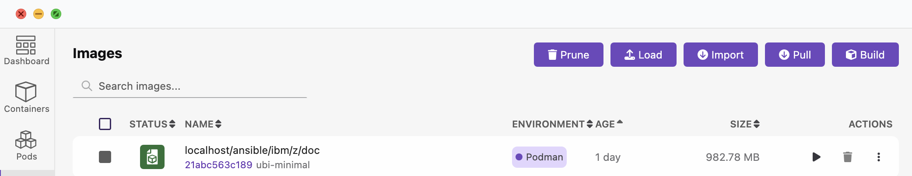<br>

      2. In this example, we will use the Containerfile absolute path with the with the [-f](https://docs.podman.io/en/latest/markdown/podman-build.1.html#file-f-containerfile) option
            ```
            podman build -f /absolute/path/to/Containerfile --tag ansible/ibm-z/doc:ubi-minimal
            ```

### 2.2 - Obtain the prebuilt image
If you would rather use the prebuilt image, you must be an IBM employee and have access to the correct repository, note that the size of the image is approximately 1 GB, if your download speed is unable to accommodate the size, consider using the `Containerfile` and built the image yourself.

1. Begin by requesting access to the prebuilt image, send an email to `hcfres@us.ibm.com` and request access to the Podman image used to build Red Hat Ansible Certified Content for IBM Z.

### 2.3 - Load the prebuilt image
1. After the download is complete, follow the instructions on how to [load images from a tar archive on your local machine](https://podman-desktop.io/tutorial/managing-your-application-resources#managing-images).Provide a reason as to why you need access.

      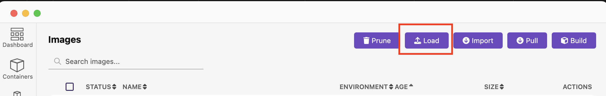<br>

      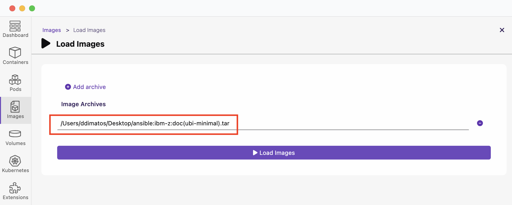<br>

## 3.0 Podman Container
In this section, we will discuss starting, stoping and attaching the container.

### 3.1 - Start the container in detached mode
Because the container includes an Apache HTTP server used to render the generated documentation before publishing, the container must be started in detached mode. The easiest way to start a container in detached mode is to use the Podman [run](https://docs.podman.io/en/latest/markdown/podman-run.1.html) command that and follows this syntax:

```
podman run [options] image [command [arg ...]]
```

The basic options for the `run` command are:
```
--detach (-d): Runs the container in the background and prints the new container ID.
--attach (-a): Runs the container in the foreground mode.
--name (-n): Assigns a name to the container. If a name is not assigned to the container then it generates a random string name.
--rm: Automatically remove the container when it exits. Note that the container will not be removed when it could not be created or started successfully.
--tty (-t): Allocates and attaches the pseudo-terminal to the standard input of the container.
--interactive (-i): For interactive processes, use -i and -t together to allocate a terminal for the container process. The -i -t is often written as -it.
--publish (-p): Publish a container’s port, or range of ports, to the host.
```

1. Start the container with the `run` command with the `--detach (-d)`, `--tty (-t)`, `--publish (-p)` and `--name (-n)` options.

    ```
    podman run -dt -p 8080:80 --name apache localhost/ansible/ibm/z/doc
    ```

    Yields the container id, note it is worth noting the container ID for use with other commands.
    ```
    ea4cf2161459c25ef9d7a76bdde1e42b8bdf06e2d92054b9c0012a4c8f0b2c56
    ```

    You can also view the container running from Podman Desktop.
    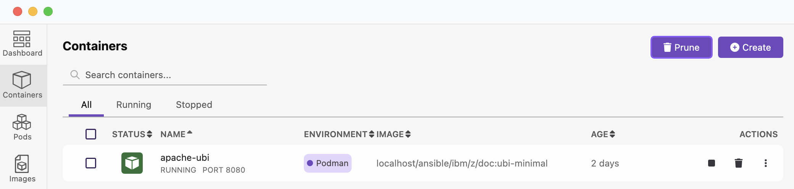<br>


    > **_NOTE:_**
    > If you start the container in Podman Desktop, by default it does not start in detached mode and therefore will not be able to view any of the generated documentation in a browser.

### 3.2 - Connect interactively to a container
There are 2 ways to connect to the container so that you can interactively run commands the containers shell much like you would on your local compute. By connecting interactively, you will be able to run any of the common commands used to generate documentation, including `git` and `ansible-playbook`.

1. From the command line you can use the Podman [exec](https://docs.podman.io/en/latest/markdown/podman-exec.1.html#name) command execute a shell process that you will be able to interact with.
   1. In order to run the `exec` command you will need to know either the containers name or Container ID, the easiest way to access this information is to use the Podman [ps command](https://docs.podman.io/en/latest/markdown/podman-ps.1.html):
        ```
        podman ps
        ```

        Yields:
        ```
        CONTAINER ID  IMAGE                                    COMMAND               CREATED       STATUS        PORTS                 NAMES
        1ec57823bcd1  localhost/ansible/ibm/z/doc:ubi-minimal  /usr/sbin/httpd -...  37 hours ago  Up 8 seconds  0.0.0.0:8080->80/tcp  apache-ubi
        ```
   2. Now that you have the container ID `1ec57823bcd1` you can run the `exec` command:
         ```
         podman exec -it 1ec57823bcd1 /bin/bash
         ```

         Yields the below, but also includes a `pwd` and `ls` just to be sure we are looking at the containers files.
         ```
         [root@1ec57823bcd1 z_ansible_collections_doc]# pwd
         /home/rhacc/z_ansible_collections_doc

         [root@1ec57823bcd1 z_ansible_collections_doc]# ls
         LICENSE    deprecated-2-site-builder.yml  group_vars  registry.yml	    setup.sh	      site-deploy.yml		  site-uploader.yml
         Makefile   deprecated-site-builder.yml	  inventory   requirements.txt	    site	      site-remove-submodules.yml  source
         README.md  env.cfg			  py-venv.sh  requirements.txt.org  site-builder.yml  site-teardown.yml
         ```

         If you want to use the container name instead of the container ID, you can find the name under the NAMES column from `ps`, that command and yield is below:
         ```
         podman exec -it apache-ubi /bin/bash
         [root@1ec57823bcd1 z_ansible_collections_doc]#
         ```

         Now you can begin running commands to generate documentation which will be covered elsewhere.

   3. Optionally, you can run the shell interactively in the container right from Podman Desktop as well.

      For that, in Podman Desktop navigate to the Containers view, find your container and select "Open Terminal" from the dot selection menu.
      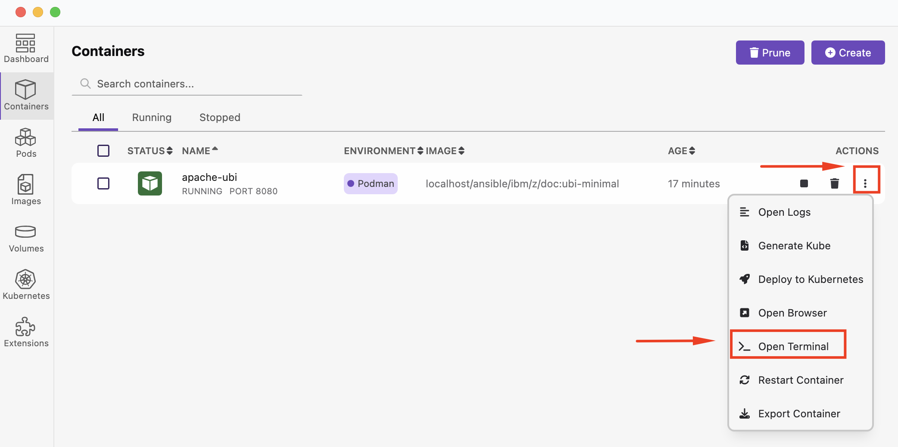<br>

      Once the terminal has been opened, you can can interact with the container under the terminal tab.
      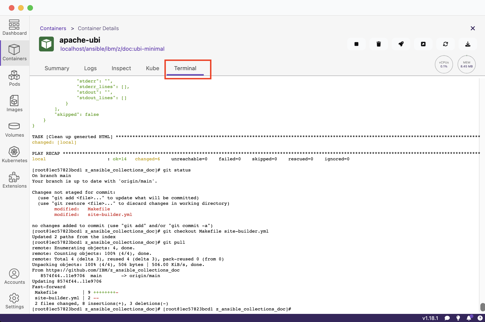<br>

### 3.3 - Other commands to aid in managing the container
There are many [more commands](https://docs.podman.io/en/latest/Commands.html) you can use to mange containers, in this section a few more will be included.

1. List the images in local storage
   ```
   $ podman images
   ```

   Yields:
   ```
   REPOSITORY                         TAG         IMAGE ID      CREATED         SIZE
   localhost/ansible/ibm/z/doc        latest      3187123ebece  56 minutes ago  585 MB
   registry.fedoraproject.org/fedora  latest      2312c2296ef8  14 hours ago    176 MB
   ```

2. Display the running processes of a container, this will show the Apache process running in this container.

   ```
   $ podman top 1ec57823bcd1
   ```

   Yields:
   ```
   USER        PID         PPID        %CPU        ELAPSED          TTY         TIME        COMMAND
   root        1           0           0.090       37m5.84660832s   pts/0       2s          /usr/sbin/httpd -DFOREGROUND
   apache      2           1           0.000       37m5.848684612s  pts/0       0s          /usr/sbin/httpd -DFOREGROUND
   apache      3           1           0.045       37m5.848731737s  pts/0       1s          /usr/sbin/httpd -DFOREGROUND
   apache      41          1           0.045       37m5.848772487s  pts/0       1s          /usr/sbin/httpd -DFOREGROUND
   apache      57          1           0.045       37m5.848818445s  pts/0       1s          /usr/sbin/httpd -DFOREGROUND
   ```
3. To stop the container

   ```
   $ podman stop 1ec57823bcd1
   ```

   Yielding below with the added `ps` check.
   ```
    $: podman stop 1ec57823bcd1
    1ec57823bcd1

    $: podman ps
    CONTAINER ID  IMAGE       COMMAND     CREATED     STATUS      PORTS       NAMES
   ```


## 4.0 Add the SSH key to your GitHub account
The container contains a SSH key, it is created as part of the image container file. You can access and write data in repositories on GitHub using SSH (Secure Shell Protocol). When you connect via SSH, you authenticate using a private key file on your local machine. This is required when you are going to be publishing the generated documentation to GitHub. This step is not required if you will only generate documentation for local viewing. 

### 4.1 - Copy the SSH public key
To copy the SSH public key, you must have an interactive session active with the container, this was covered in [section 3.2](../03/README.md#32---connect-interactively-to-a-container).

1. Dump the public SSH Public Key contents to the terminal and copy them with command:
   ```
   cat ~/.ssh/id_ed25519.pub
   ```

   Yields:
   ```
   ssh-ed25519 AAAAC3NzaC1lZDI1NTE5AAAAIKc7ljRIjVgAxJyVLb+k9W5/0XBfQfHeqtq/5hoavM52 hcf-admin@ibm.com
   ```

   > **_NOTE:_**
   > The key that will display for your container instance will not be the same as the example above, be sure to extract the SSH public key retained in your container.


### 4.2 - Add the SSH public key to GitHub
To add the SSH public key, follow the [instructions provided by GitHub](https://docs.github.com/en/authentication/connecting-to-github-with-ssh/adding-a-new-ssh-key-to-your-github-account#adding-a-new-ssh-key-to-your-account).

Below are a series of screen captures that align to the link provided by Git Hub on how to add the SSH public key.

1. In the upper-right corner of any page on GitHub, click your profile photo, then click  Settings.  
    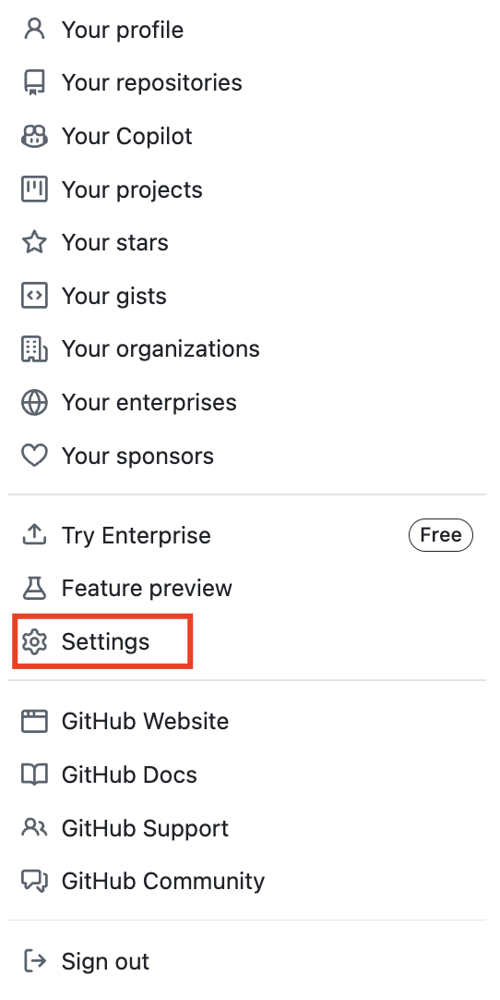<br>

2. In the "Access" section of the sidebar, click  SSH and GPG keys.  
    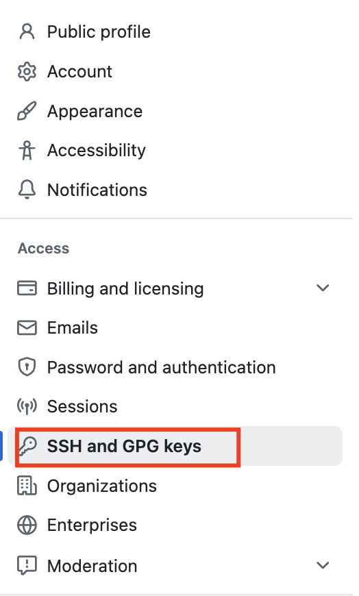<br>

3. Click New SSH key or Add SSH key.  
    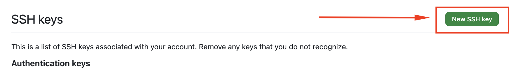<br>

4. In the "Title" field, add a descriptive label for the new key. For example, "IBM-Z-containerized-doc-pub-key".
   1. Select the "Authentication Key" as the type of key.  
   2. Click Add SSH key.  
    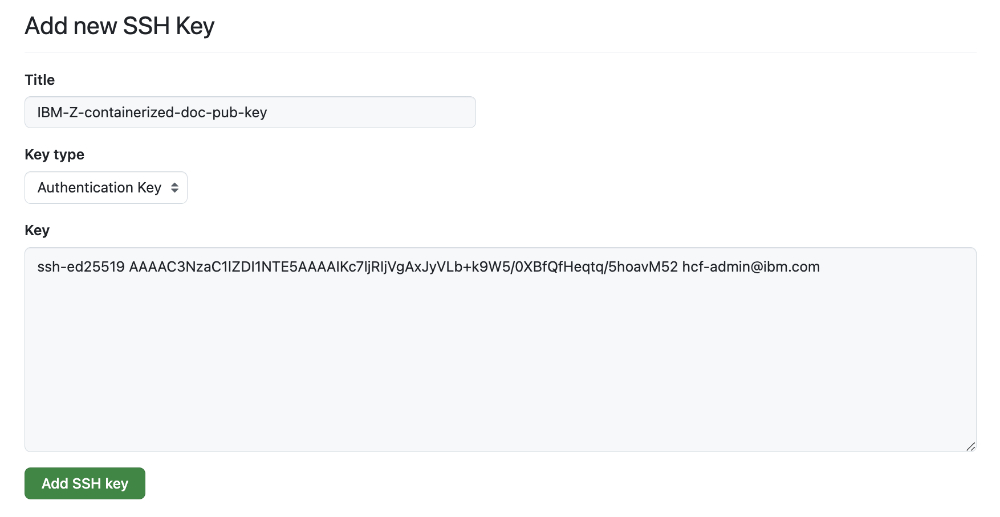<br>
    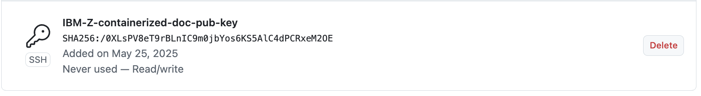<br>